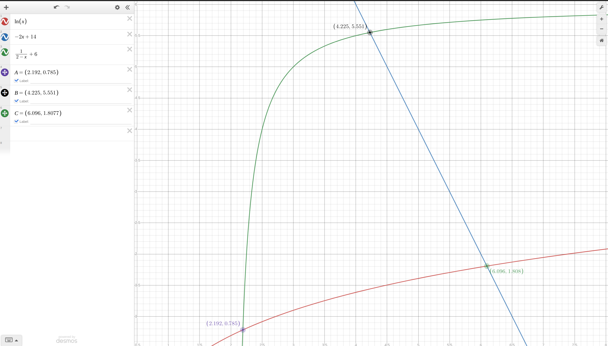

# Домашнее задание №6
## Сборка многомодульных программ. Вычисление корней уравнений и определенных интегралов

### Постановка задачи
С заданной точностью ε вычислить площадь плоской фигуры, ограниченной тремя кривыми.

### Вариант задания 1
1. **Уравнения кривых:** вариант 7.
   1. <var>f</var>1 = ln(x),
   2. <var>f</var>2 = -2x+14,
   3. <var>f</var>3 = 1/(2-x)+6.

2. **Метод приближенного решения уравнений:** метод касательных.
3. **Квадратурные формулы:** формула трапеций. 

---

